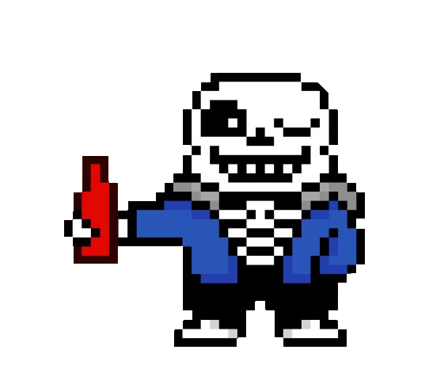

# 🎮 Press Me - An Undertale-Inspired Prank

A funny prank web app inspired by Undertale and MSN emojis, built with HTML, CSS, and JavaScript.



---

## 🧠 What is this?

This is a pixel-style prank project that begins innocently with a "PRESS ME" button... You'll find out once you run it heheh

---

## ✨ Features
- Particles
- Image and audio inserts
- Some ephemeral fun


---

## 🚀 How to Run

1. Clone the repository:
   ```bash
   git clone https://github.com/TanakaLeo/ketchuprank.git
2. Open the folder in your code editor
3. Start a local server
4. Or just open index.html directly in your browser

---

## Technologies Used


